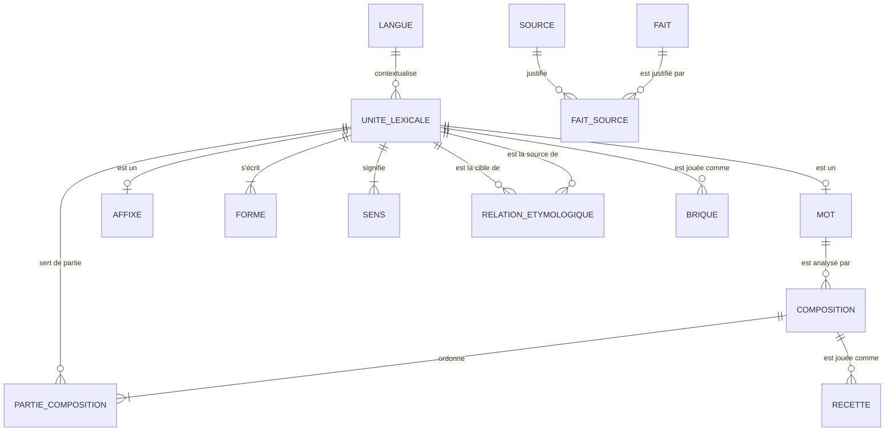
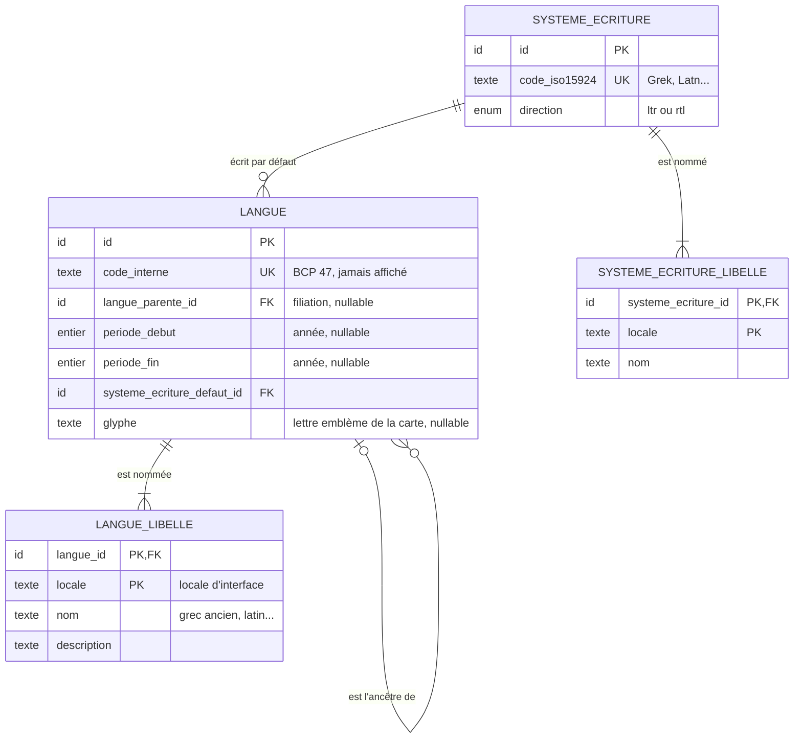
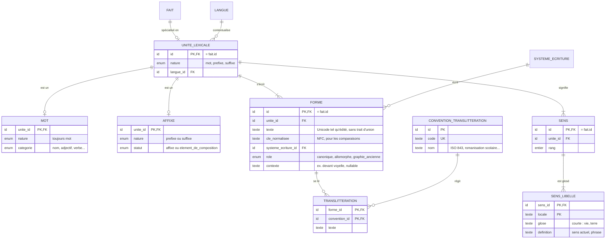
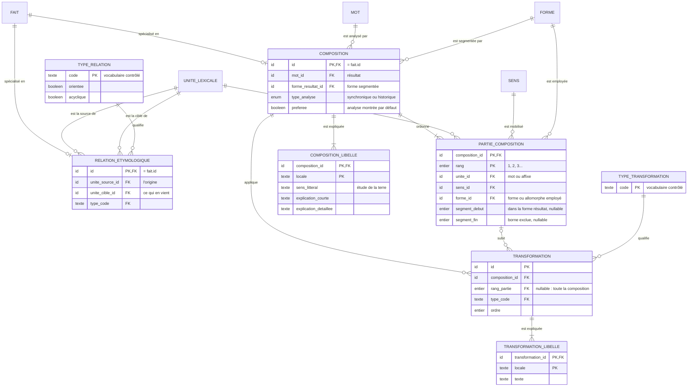
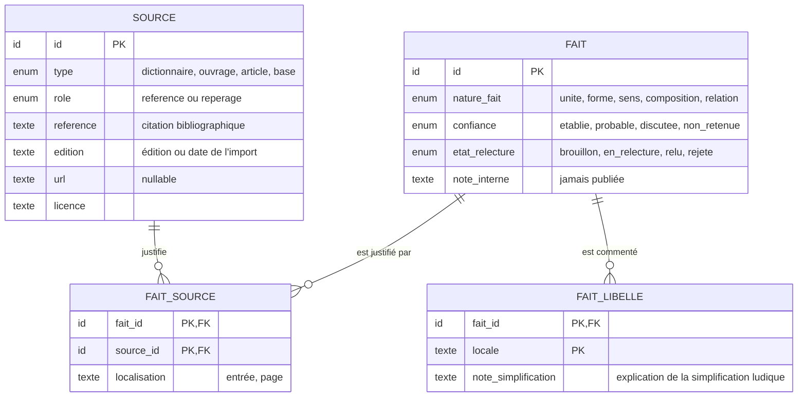
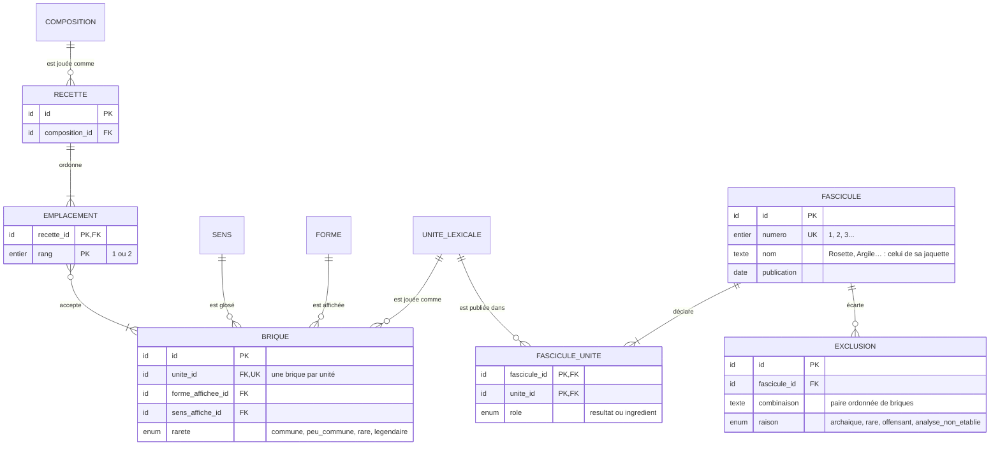
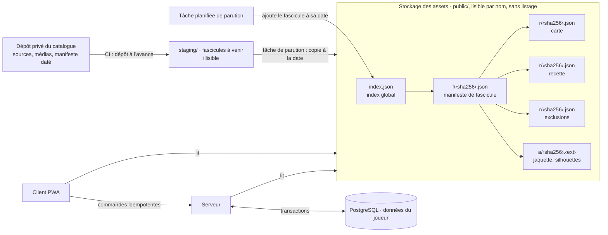

# ÉtymoLogique — Modèle de données des briques

Ce document décrit le **schéma relationnel logique** des objets au cœur du jeu : **langues, mots, préfixes et suffixes**. Ce schéma logique ne dépend pas du moteur. Il fixe les entités, leurs attributs, leurs clés, leurs cardinalités et les contraintes que tout stockage devra respecter. Les sections 6 et 7 disent où vit chaque donnée : catalogue statique publié par fascicules, données du joueur dans PostgreSQL sous autorité serveur, et le reste ([ADR 0024](adr/0024-architecture-logicielle-et-hebergement.md) à [ADR 0027](adr/0027-catalogue-statique-et-donnees-joueur.md)).

Une présentation illustrée est disponible sur la page [modèle de données](modele.html). Les choix structurants sont actés dans l'[ADR 0013](adr/0013-schema-des-briques.md). Le document applique les ADR [0002](adr/0002-graphe-linguistique-editorial.md) (graphe éditorial), [0003](adr/0003-recettes-de-fusion.md) (recettes), [0006](adr/0006-architecture-multilingue.md) (multilingue) et [0009](adr/0009-contenu-et-equilibrage.md) (séparation des couches).

> Les exemples étymologiques ci-dessous servent à éprouver le schéma. Ils devront être vérifiés et sourcés avant toute publication.

## Principes

1. **Identifiants opaques et stables.** Un identifiant ne contient jamais de graphie : corriger un accent ne crée pas une nouvelle brique. Les exemples utilisent `lng_01`, `unt_05`, etc.
2. **Une unité lexicale pour les mots, préfixes et suffixes.** Les trois partagent un supertype, `unite_lexicale`. Compositions, relations, sources et briques pointent donc tous vers une même cible. Un mot peut ainsi redevenir un ingrédient (*biologie* + *-iste*).
3. **La langue n'est pas une unité lexicale.** C'est le contexte d'une unité. Elle a sa carte dans le codex mais ne peut pas, par construction, devenir une brique posée sur la table.
4. **Pas de type « étymon ».** Un étymon est une unité lexicale d'une langue source (le grec *gê*), reliée par une relation étymologique. *géo-* est un préfixe **du français**, forme de composition du grec *gê*. *philo-* et *-phile* sont deux unités distinctes, reliées au même grec *phílos*.
5. **Forme, sens et translittération sont séparés de l'unité.** Une unité a une ou plusieurs graphies, un ou plusieurs sens, et chaque forme peut avoir des translittérations.
6. **Le texte d'une forme est stocké sans trait d'union.** La position vient de la nature de l'unité (préfixe ou suffixe). Une brique n'est jamais affichée en texte brut : le trait d'union n'est qu'une convention de rendu éventuelle.
7. **Tout ce qui est affirmé est un fait.** Unités, formes, sens, compositions et relations héritent du supertype `fait`. Ils portent un niveau de confiance, un état de relecture et des sources.
8. **Aucun libellé traduit dans les tables de faits.** Noms, gloses, définitions et explications vivent dans des tables `…_libelle`, indexées par locale d'interface.
9. **La couche ludique référence la couche linguistique, jamais l'inverse.** Brique, recette et rareté restent hors des faits.

## Vue d'ensemble

Le schéma se lit en quatre blocs : les langues et les écritures, les unités avec leurs formes et leurs sens, les compositions et les relations, puis le socle éditorial. Un dernier bloc esquisse les points d'ancrage de la couche ludique.

## 1. Langues et écritures

| Table | Rôle | Remarques |
|---|---|---|
| `langue` | Langue affichée dans le codex. | Le MVP compte **trois langues, sans variété** : grec ancien, latin, français. Une forme médiévale ou tardive reste rattachée à sa langue ; si la précision compte, elle va dans l'explication ou la `note_simplification`. `langue_parente_id` décrit la généalogie des langues, pas les emprunts : un emprunt se déclare entre unités. `glyphe` est la lettre emblème de la carte de langue du codex (É, Æ, Ω) ; sans glyphe, la carte prend l'initiale du nom. |
| `langue_libelle` | Nom affiché dans chaque locale. | Le joueur voit toujours le nom complet (ADR 0006). `code_interne` reste strictement technique. |
| `systeme_ecriture` | Alphabet grec, latin, cyrillique… | Porte la direction d'écriture, utile au rendu fragment par fragment. |

La carte de langue du codex n'est pas stockée : son verso regroupe les unités découvertes dont `langue_id` vaut cette langue.

## 2. Unités, formes et sens

| Table | Rôle | Remarques |
|---|---|---|
| `unite_lexicale` | Supertype de tout ce qui se compose ou se relie. | `nature` sert de discriminant. Chaque unité a exactement un sous-type. |
| `mot` | Lexème autonome (*géologie*, grec *gê*). | Un mot peut être un résultat de composition **et** une partie d'une autre composition. |
| `affixe` | Préfixe ou suffixe. | `statut` distingue un affixe vrai (*-iste*) d'un élément de composition savant (*géo-*, *-logie*). Pour le joueur, les deux restent des préfixes ou des suffixes. |
| `forme` | Graphie attestée. | La `forme canonique` est celle de la brique. Les allomorphes (*phil-* devant voyelle) et les graphies anciennes restent des formes de la **même** unité, jamais de nouvelles briques : le joueur pose *philo-*, et la recette applique une transformation d'allomorphie. |
| `translitteration` | Lecture d'une forme selon une convention. | Une translittération n'est pas une racine collectionnable (ADR 0006). Elle exige une convention déclarée (ADR 0005). |
| `sens` | Acception d'une unité. | Une partie de composition désigne le sens précis qu'elle mobilise. |
| `sens_libelle` | Glose et définition par locale. | La glose sert aux briques (« terre »). La définition actuelle est obligatoire pour un mot découvrable. |

**Pourquoi `nature` est répétée dans `mot` et `affixe`.** C'est la technique du discriminant partagé : le sous-type référence la paire (`unite_id`, `nature`) de `unite_lexicale`, et une contrainte fixe la valeur admise dans chaque sous-type. Une unité ne peut ainsi être à la fois un mot et un affixe, et un affixe ne peut pas changer de position en silence.

## 3. Compositions et relations étymologiques

### Composition

Une `composition` est l'analyse d'un mot en parties ordonnées. C'est une relation **n-aire** : elle ne peut pas tenir dans une relation étymologique, qui relie deux unités. Le vocabulaire de relations ne contient donc pas de type « composition ».

- **Plusieurs analyses par mot.** Un mot peut avoir une analyse synchronique (ce que le joueur recompose en français) et une analyse historique (le composé déjà formé en grec). Si deux analyses sont en concurrence, chacune porte la confiance « discutée ». `preferee` désigne celle qu'affiche la fiche.
- **Parties.** Chaque partie désigne une unité (mot ou affixe), le sens qu'elle mobilise et la forme employée. Le **segment** donne sa place dans la forme résultat : c'est ce qui permet de surligner le mot morceau par morceau avec la couleur de chaque brique. Il est nul si le mot n'est pas segmentable.
- **Sens littéral.** Il appartient à la composition, pas au mot : *philologie* signifie littéralement « amour des mots », mais sa définition actuelle est tout autre.
- **Transformations.** Elles décrivent l'écart entre les parties et le résultat (élision, voyelle de liaison, allomorphie, adaptation de graphie). Une transformation vise une partie ou l'ensemble de la composition. Son type appartient à un vocabulaire contrôlé (ADR 0003).

### Relation étymologique

Une relation relie une unité **source** (l'origine) à une unité **cible** (ce qui en vient). Vocabulaire initial :

| Code | Sens | Orientée | Acyclique |
|---|---|---|---|
| `heritage` | Transmission continue d'une langue à sa descendante. | oui | oui |
| `emprunt` | Passage d'une langue à une autre. | oui | oui |
| `derivation` | Formation à l'intérieur d'une langue. | oui | oui |
| `forme_de_composition` | Élément de composition tiré d'un mot (*géo-* ← *gê*). | oui | oui |
| `adaptation` | Réfection de forme ou de graphie. | oui | oui |
| `apparentement` | Parenté sans filiation directe connue. | non | non |

Les chemins longs se construisent en enchaînant des relations : français *étymologie* ← latin *etymologia* ← grec *etumología*. Le verso d'une carte (« formes dans chaque langue, 2 sur 3 ») n'est donc pas stocké : c'est la fermeture de ces relations depuis l'unité, filtrée par ce que le joueur a découvert.

## 4. Socle éditorial : faits et sources

Une source a un **rôle** ([ADR 0014](adr/0014-sources-et-fascicules.md)) :

- `reference` : dictionnaire ou ouvrage qui fait autorité (TLFi, Académie française, Gaffiot, Bailly, Chantraine…). C'est elle qui fixe le niveau de confiance ;
- `reperage` : le Wiktionnaire et les outils d'extraction. Un fait qui n'a qu'une source de repérage reste un `brouillon` : il n'est jamais publié.

`fait` est le supertype éditorial des unités, formes, sens, compositions et relations : leur identifiant **est** celui du fait. Un seul lien `fait_source` suffit donc à sourcer n'importe quelle affirmation, sans clé étrangère polymorphe.

- Le **niveau de confiance** ne devient jamais une rareté (ADR 0009).
- `note_interne` reste hors de l'artefact client (ADR 0005). `note_simplification` est publiée et traduite.
- Une langue, une écriture ou une convention ne sont pas des faits : ce sont des référentiels.

## 5. Points d'ancrage de la couche ludique

Cette couche n'est qu'esquissée ici. Elle sera détaillée dans un travail séparé.

- Une **brique** pointe vers une unité lexicale : mot, préfixe ou suffixe. Aucune langue ne peut donc être posée sur la table.
- **Une brique par unité**, et une unité a au plus une brique. Un allomorphe n'est jamais une brique à part : la recette qui l'emploie le déclare comme transformation (ADR 0003). La réserve, le tirage des plis et la carte du codex restent donc uniques pour *philo-*, qu'il s'écrive *philo* ou *phil*.
- Une **recette** s'appuie sur une composition validée. Elle ne peut pas inventer un fait (ADR 0009). Elle a **exactement deux emplacements**, rangs 1 et 2 : la table de fusion n'en accepte jamais davantage ([ADR 0032](adr/0032-fusion-de-deux-briques.md)). Chaque emplacement accepte une ou plusieurs briques (variantes admises, ADR 0003). Une composition de trois parties ou plus n'est donc pas jouable telle quelle.
- Les **cartes du codex** sont dérivées. Une unité a sa propre carte **si et seulement si** elle est référencée par une brique ou par le résultat d'une recette :
  - carte de mot ou de brique : l'unité, ses formes, ses sens et les compositions où elle apparaît ;
  - carte de langue : les unités de cette langue.
- Les **étymons** (grec *gê*, *phílos*, latin *etymologia*) n'ont pas de carte propre. Ils apparaissent au verso des cartes qui en descendent (« formes dans chaque langue ») et sur la carte de leur langue.
- Deux **homographes** sont deux unités, donc deux briques et deux cartes. Rien dans leur identifiant ni dans leur libellé ne les numérote : le joueur les distingue par les autres attributs de la carte (voir les contraintes).
- Un **fascicule** est l'unité de publication du contenu : 20 à 30 mots environ tous les 30 jours ([ADR 0014](adr/0014-sources-et-fascicules.md), [ADR 0022](adr/0022-fascicules-de-20-a-30-mots.md)). Il déclare toutes les unités dont il a besoin :
  - `resultat` : les mots qu'il publie. Un mot est le résultat d'**un seul** fascicule ;
  - `ingredient` : les préfixes, suffixes et mots qui servent à ses recettes. Une unité déjà publiée peut être reprise comme ingrédient par plusieurs fascicules.
- Une **exclusion** enregistre une combinaison attestée volontairement non publiée, avec sa raison.
- Rareté, poids de tirage, graines, jalons et visibilité restent dans la couche ludique. Les graines sont déclarées par le fascicule ([ADR 0030](adr/0030-reserve-de-depart-par-fascicule.md)).
- Les **familles** sont hors du périmètre de ce document.

## 6. Où vivent les données

Les sections précédentes décrivent des tables logiques. Elles ne sont pas stockées telles quelles : le compilateur ([ADR 0005](adr/0005-pipeline-de-contenu.md)) les regroupe en fichiers. L'[ADR 0027](adr/0027-catalogue-statique-et-donnees-joueur.md) fixe trois lieux :

- le **stockage des assets** : le catalogue publié, en fichiers statiques dans l'Object Storage public, derrière le CDN ([ADR 0024](adr/0024-architecture-logicielle-et-hebergement.md)). Le client et le serveur lisent les mêmes fichiers ; aucune API ne sert le contenu ;
- le **stockage des données du joueur** : les tables PostgreSQL de l'[ADR 0024](adr/0024-architecture-logicielle-et-hebergement.md), que seul le serveur lit et écrit (section 7) ;
- **ailleurs** : le dépôt privé du catalogue ([ADR 0026](adr/0026-depot-prive-du-catalogue-sans-logique.md)), Secret Manager, la télémétrie et le stockage local du client.

### Carte de répartition

| Donnée | Lieu | Lisible |
|---|---|---|
| `langue`, `systeme_ecriture`, `convention_translitteration` et leurs libellés | index global | par tous |
| Liste des fascicules parus : numéro, date, chemin du manifeste | index global | par tous, à partir de la date de parution |
| `fascicule`, `fascicule_unite`, jaquette, compteurs hors légendaires, paramètres du pli (raretés, poids) | manifeste de fascicule | par tous, dès la parution |
| `unite_lexicale`, `mot` ou `affixe`, `forme`, `translitteration`, `sens` et leurs libellés | carte de l'unité | par tous, dès la parution |
| `relation_etymologique` dont l'unité est la cible, avec les étymons qu'elles désignent | carte de l'unité | par tous, dès la parution |
| `composition`, `partie_composition`, `transformation` et leurs libellés | carte du mot résultat | par tous, dès la parution |
| `brique` : forme et sens affichés, rareté | carte de l'unité | par tous, dès la parution |
| `recette`, `emplacement`, préconditions, déblocages | recette | par tous, dès la parution |
| `exclusion` relue | exclusions du fascicule | par tous, dès la parution |
| `fait` : confiance ; `fait_libelle` : `note_simplification` ; `source` et `fait_source` des faits publiés | recopiés dans chaque carte qui les cite | par tous, dès la parution |
| `fait.note_interne`, `etat_relecture`, faits `brouillon`, `rejete` ou `non_retenue`, sources de repérage seules | dépôt privé du catalogue | équipe éditoriale |
| Imports datés du Wiktionnaire, médias bruts, manifeste serveur daté, migrations déclaratives ([ADR 0026](adr/0026-depot-prive-du-catalogue-sans-logique.md)) | dépôt privé du catalogue | équipe éditoriale |
| Réserve, codex, énergie, encre, sabliers, plis, indices, jalons, commandes | données du joueur (section 7) | serveur seul |
| Événements produit, journaux opérationnels | télémétrie et journaux ([ADR 0010](adr/0010-observabilite-et-vie-privee.md)) | équipe, accès tracés |
| Secrets du serveur, de la base et de la CI | Secret Manager | serveur et CI |
| Propositions brutes de fusion | **nulle part** | — |

Le stockage des assets ne contient donc que des faits `relu` et publiés. Rien de ce qui est affirmé dans le jeu n'échappe au circuit de l'[ADR 0005](adr/0005-pipeline-de-contenu.md).

### Chemins en hash de contenu

- Chaque manifeste et chaque ressource est rangé sous l'empreinte **SHA-256** de son contenu, comme les médias de l'[ADR 0025](adr/0025-medias-statiques-et-publication-programmee.md). Le chemin ne contient ni identifiant ni graphie.
- Un fichier publié **ne change jamais**. Le client et le CDN le gardent en cache sans limite. Une unité reprise comme ingrédient par un fascicule suivant garde le même fichier : les deux manifestes pointent vers le même chemin.
- L'**index global** est le seul fichier modifiable, à chemin fixe. Il tient le rôle du manifeste public de l'[ADR 0025](adr/0025-medias-statiques-et-publication-programmee.md). Le client le revalide à chaque lancement ; l'API le relit au plus toutes les 60 s.
- Le préfixe `public/` du bucket est **lisible par nom et sans listage** : on ne peut lire un fichier qu'en connaissant son chemin. Le préfixe `staging/`, où attendent les fascicules à venir, n'est lisible que par la tâche de parution et la CI du catalogue ([ADR 0029](adr/0029-parution-par-promotion-de-prefixe.md)).

### Index global

| Champ | Contenu |
|---|---|
| `version` | Identifiant de la publication, qui associe version linguistique et version ludique ([ADR 0009](adr/0009-contenu-et-equilibrage.md)). |
| `langues`, `systemes_ecriture`, `conventions` | Référentiels communs et leurs libellés par locale. Une langue indique le fascicule qui l'a introduite ([ADR 0015](adr/0015-codex-fascicules-et-legendaires.md)). |
| `fascicules` | Pour chaque fascicule paru : `numero`, `parution` (date et heure), `manifeste` (chemin haché). |

L'index ne cite que des manifestes, jamais une ressource : c'est le manifeste qui mène à ses cartes, recettes, exclusions et médias. Le calendrier `staging/parutions.json` suit la même règle pour les fascicules à venir ([ADR 0029](adr/0029-parution-par-promotion-de-prefixe.md)).

Un fascicule à paraître n'apparaît pas dans l'index, même sous forme de compteur ([ADR 0014](adr/0014-sources-et-fascicules.md)).

### Manifeste de fascicule

| Champ | Contenu |
|---|---|
| `id`, `numero`, `parution` | Identifiant opaque du fascicule, par lequel les données du joueur le désignent ; numéro et date de parution. |
| `jaquette` | Chemin haché de l'asset de la jaquette ([ADR 0016](adr/0016-plis-et-jaquettes-par-fascicule.md)). |
| `compteurs` | Mots, préfixes, suffixes et langues, **légendaires exclues**, ainsi que les mots qui en dépendent ([ADR 0015](adr/0015-codex-fascicules-et-legendaires.md)). |
| `pli` | Briques tirables (ses préfixes et suffixes, nouveaux ou repris ; jamais un mot, [ADR 0035](adr/0035-plis-d-affixes-ponderes-par-la-rarete.md)), poids des raretés, base d'encre, barèmes des doublons : les paramètres d'équilibrage de ce fascicule. |
| `cartes` | Pour chaque unité déclarée (`fascicule_unite`) : identifiant opaque, rôle (`resultat` ou `ingredient`), chemin haché de sa carte, chemin de sa silhouette. |
| `langues` | Pour chaque langue citée par ses cartes (langue d'une unité ou d'un étymon) : identifiant et chemin haché de sa silhouette ([ADR 0023](adr/0023-textures-des-cartes.md)). Comme l'index ne cite que des manifestes, c'est le manifeste qui mène aux silhouettes des langues et la tâche de parution les promeut avec le fascicule. |
| `recettes` | Identifiant opaque et chemin haché de chaque recette du fascicule. |
| `exclusions` | Chemin haché du fichier d'exclusions. |
| `jalons` | Jalons du fascicule, leurs conditions et leurs récompenses déterministes ([ADR 0012](adr/0012-briques-rationnees.md)). |
| `graines` | Réserve de départ du fascicule : pour chaque brique semée, `brique_id` et `exemplaires`, de 1 à 5 ([ADR 0030](adr/0030-reserve-de-depart-par-fascicule.md)). |

### Ressources

| Ressource | Contenu |
|---|---|
| **Carte** d'une brique ou d'un mot | L'unité, ses formes et translittérations, ses sens, ses relations et étymons (forme, langue, glose), et pour un mot ses compositions, parties, segments et transformations. Les libellés de chaque locale, la confiance, la `note_simplification` et les sources de chaque fait. Pour une brique, sa forme affichée, son sens affiché et sa rareté. |
| **Recette** | Identifiant, mot résultat, composition jouée, emplacements ordonnés et briques acceptées, préconditions, déblocages. |
| **Exclusions** | Pour chaque combinaison écartée : paire ordonnée de briques et raison, qui permettent un retour honnête au joueur ([ADR 0014](adr/0014-sources-et-fascicules.md)). |
| **Asset** | Jaquette, silhouettes des cartes et des langues ([ADR 0023](adr/0023-textures-des-cartes.md)), en SVG servi en `image/svg+xml`, sous `a/‹sha256›.svg`. |

Une carte recopie les faits dont elle a besoin : les sources ou les étymons partagés sont dupliqués d'une carte à l'autre. C'est le prix d'une carte lisible en un seul fichier ; la source de vérité reste le dépôt privé du catalogue.

La carte d'une langue n'est pas un fichier : le client la construit à partir de l'index et des cartes déjà découvertes.

### Parution d'un fascicule

1. Le compilateur produit les ressources et le manifeste, puis vérifie chaque empreinte.
2. La CI du dépôt privé dépose les fichiers **à l'avance** sous `staging/`, illisible pour le client, et inscrit la date d'effet dans le calendrier `staging/parutions.json` ([ADR 0029](adr/0029-parution-par-promotion-de-prefixe.md)).
3. À la date d'effet, la **tâche planifiée** de l'[ADR 0025](adr/0025-medias-statiques-et-publication-programmee.md) lit le manifeste du fascicule dans `staging/`, copie vers `public/` les ressources qu'il cite puis le manifeste, applique les migrations de progression, puis ajoute le fascicule à l'index global. Elle est idempotente : relancée, elle ne change rien. L'API accepte les commandes du fascicule dès qu'elle lit le nouvel index.
4. Le client voit le nouveau fascicule à sa prochaine lecture de l'index.

Une correction produit une ressource au nouveau hash, donc un nouveau manifeste et une nouvelle version de l'index. L'ancienne version reste lisible pour les parties qui l'utilisent encore.

### Les recettes sont publiques, le serveur fait foi

Une fois le fascicule paru, ses recettes et ses légendaires sont lisibles dans ses fichiers. Le secret des légendaires tient à l'interface : pas de silhouette, pas de compteur ([ADR 0015](adr/0015-codex-fascicules-et-legendaires.md)).

En ligne, le client peut résoudre une fusion localement pour répondre tout de suite ; hors connexion, la tentative attend le réseau ([ADR 0024](adr/0024-architecture-logicielle-et-hebergement.md)). Ce n'est qu'une prévisualisation : le **serveur fait foi**. Il lit les mêmes fichiers, valide la recette et ses préconditions, vérifie la réserve, consomme les exemplaires et met à jour le codex, dans une seule transaction. Il en va de même pour l'énergie, les plis, l'encre, les sabliers, les indices et les jalons ([ADR 0007](adr/0007-etat-et-economie-autoritaires.md)).

## 7. Données du joueur

La progression vit dans les tables relationnelles PostgreSQL de l'[ADR 0024](adr/0024-architecture-logicielle-et-hebergement.md), que seul le serveur lit et écrit ([ADR 0007](adr/0007-etat-et-economie-autoritaires.md)). Cette section en donne le schéma logique et le complète par l'historique des plis, les indices, les jalons atteints et les migrations ([ADR 0027](adr/0027-catalogue-statique-et-donnees-joueur.md)).

Ces tables désignent le catalogue par ses identifiants opaques (`brique_id`, `mot_id`, `recette_id`, `fascicule_id`), jamais par une graphie, et n'en copient aucun texte. Le catalogue, lui, ne les référence jamais.

```mermaid
erDiagram
    JOUEUR ||--o{ EXEMPLAIRE : "possède"
    JOUEUR ||--o{ DECOUVERTE : "a découvert"
    JOUEUR ||--|| ENERGIE : "recharge"
    JOUEUR ||--|| ENCRE : "détient"
    JOUEUR ||--|| SABLIER : "détient"
    JOUEUR ||--o{ COMPTEUR_PLI : "suit"
    JOUEUR ||--o{ OUVERTURE_PLI : "a ouvert"
    JOUEUR ||--o{ INDICE : "a obtenu"
    JOUEUR ||--o{ JALON_ATTEINT : "a atteint"
    JOUEUR ||--o{ REGLAGE : "choisit"
    JOUEUR ||--o{ COMMANDE : "envoie"
    JOUEUR ||--o{ MOUVEMENT : "cumule"
    JOUEUR ||--o{ MIGRATION : "a suivi"
    JOUEUR ||--o{ GRAINE_ACCORDEE : "a reçu"

    JOUEUR {
        id id PK "aléatoire, sans donnée personnelle"
        texte empreinte_secret "jamais le secret lui-même"
        entier version_etat "incrémentée à chaque commande"
        texte version_catalogue "version active du joueur"
        instant cree_le
        instant derniere_activite
    }
    EXEMPLAIRE {
        id joueur_id PK, FK
        id brique_id PK "catalogue"
        entier nombre "0 à 5, 0 = épuisée"
        instant connue_le
    }
    DECOUVERTE {
        id joueur_id PK, FK
        id mot_id PK "catalogue"
        id recette_id "catalogue"
        entier numero "rang de la découverte"
        instant decouverte_le
    }
    ENERGIE {
        id joueur_id PK, FK
        entier charges "0 à 2"
        instant prochaine_charge "nulle si 2 charges"
    }
    ENCRE {
        id joueur_id PK, FK
        entier gouttes "positif ou nul"
    }
    SABLIER {
        id joueur_id PK, FK
        entier detenus "0 à 36"
    }
    COMPTEUR_PLI {
        id joueur_id PK, FK
        id fascicule_id PK "catalogue"
        entier plis_sans_nouveaute "garantie au 6e"
        entier plis_sans_utilite "filet au 5e"
    }
    OUVERTURE_PLI {
        id id PK
        id joueur_id FK
        id fascicule_id "catalogue"
        enum origine "energie ou jalon"
        id brique_id "catalogue"
        enum resultat "nouvelle, doublon, reserve_pleine"
        enum regle "tirage, garantie, filet, deterministe"
        texte version_equilibrage
        instant ouvert_le
    }
    INDICE {
        id joueur_id PK, FK
        id recette_id PK "catalogue"
        entier niveau PK "1 à 5"
        instant obtenu_le
    }
    JALON_ATTEINT {
        id joueur_id PK, FK
        id jalon_id PK "catalogue"
        instant atteint_le
    }
    REGLAGE {
        id joueur_id PK, FK
        texte cle PK "thème, locale, mouvement réduit"
        texte valeur "valeur énumérée"
    }
    COMMANDE {
        id joueur_id PK, FK
        id id PK "clé d'idempotence du client"
        enum type "fusion, ouvrir_pli, sablier, indice..."
        enum statut "acceptee, refusee, conflit"
        texte reponse "rejouée à l'identique"
        instant recue_le "purgée après 30 jours"
    }
    MOUVEMENT {
        id id PK
        id joueur_id FK
        id commande_id "trace, sans clé étrangère"
        enum ressource "exemplaire, encre, sablier, charge"
        id brique_id "si exemplaire, nullable"
        entier delta "+1, -1, +2..."
        enum motif "decouverte, pli, doublon, sablier, indice, jalon, depart"
        instant le
    }
    GRAINE_ACCORDEE {
        id joueur_id PK, FK
        id fascicule_id PK "catalogue"
        instant accordee_le
    }
    MIGRATION {
        id joueur_id PK, FK
        texte version_depart PK
        texte version_arrivee
        instant appliquee_le
    }
```

| Table | Rôle | Remarques |
|---|---|---|
| `joueur` | Profil invité. | Un identifiant aléatoire et l'empreinte d'un secret de 256 bits. Ni nom, ni adresse électronique, ni adresse réseau ([ADR 0024](adr/0024-architecture-logicielle-et-hebergement.md)). `version_etat` permet de détecter un conflit (`409`). |
| `exemplaire` | La réserve : briques connues et leurs exemplaires. | Une ligne par brique connue, créée à sa première obtention. La connaissance est permanente : une brique à 0 exemplaire reste, marquée épuisée ([ADR 0012](adr/0012-briques-rationnees.md)). Les exemplaires réservés sur la table ne sont jamais stockés ici : ils restent locaux. |
| `decouverte` | Le codex du joueur. | Une ligne par mot découvert. Les cartes de brique viennent de `exemplaire` ; les cartes de langue sont dérivées des deux. |
| `energie` | Charges de pli. | 2 charges au plus, une toutes les 12 h ; `prochaine_charge` est nulle quand l'énergie est pleine : le temps s'arrête ([ADR 0020](adr/0020-deux-plis-en-attente-et-sabliers.md)). Un sablier avance cet instant d'une heure. |
| `encre`, `sablier` | Soldes. | Encre jamais négative, 36 sabliers détenus au plus ([ADR 0020](adr/0020-deux-plis-en-attente-et-sabliers.md)). |
| `compteur_pli` | Garantie de nouveauté et filet d'utilité. | Tenus par fascicule ([ADR 0016](adr/0016-plis-et-jaquettes-par-fascicule.md)). |
| `ouverture_pli` | Historique des plis. | Brique tirée, résultat et règle appliquée, pour le diagnostic sans donnée personnelle ([ADR 0008](adr/0008-energie-et-plis.md)). |
| `indice` | Indices obtenus. | Un niveau d'une recette n'est payé qu'une fois. |
| `jalon_atteint` | Jalons atteints. | Un jalon ne se touche qu'une fois ; sa récompense passe par une `ouverture_pli` d'origine `jalon` ou par un `mouvement`. |
| `reglage` | Préférences non sensibles. | Valeurs énumérées seulement, jamais de texte libre. Le client en garde une copie. |
| `commande` | Commandes reçues. | La clé d'idempotence vient du client. Une commande rejouée renvoie la `reponse` enregistrée sans rien modifier. Purgée après 30 jours ([ADR 0024](adr/0024-architecture-logicielle-et-hebergement.md)). |
| `mouvement` | Journal des gains et consommations, en ajout seul. | Chaque variation d'exemplaires, d'encre, de sabliers ou de charges est une ligne. `exemplaire`, `encre`, `sablier` et `energie` en sont les soldes. Le plafond de 12 sabliers par 24 h glissantes se vérifie à partir d'eux. |
| `migration` | Migrations de progression. | Une ligne par passage d'une version du catalogue à une autre, appliquée par la tâche planifiée de parution ([ADR 0025](adr/0025-medias-statiques-et-publication-programmee.md)). |
| `graine_accordee` | Réserves de départ reçues. | Une ligne par fascicule semé : ses graines ne sont accordées qu'une fois ([ADR 0030](adr/0030-reserve-de-depart-par-fascicule.md)). Chaque exemplaire accordé est un `mouvement` de motif `depart`. |

**Ce qui n'est jamais stocké** : les propositions de fusion (échecs, « presque », recettes déjà connues). Elles ne modifient rien, donc elles ne laissent aucune ligne ; la télémétrie n'en garde qu'un compteur par résultat ([ADR 0010](adr/0010-observabilite-et-vie-privee.md)).

### Exemple : une découverte

Le joueur pose *géo-* et *-logie*. En ligne, le client lit la recette dans le catalogue public et prévisualise la découverte. Il envoie la commande `fusion` avec sa clé d'idempotence et sa `version_etat`. Dans une seule transaction, le serveur :

1. vérifie que la commande n'a pas déjà été traitée, sinon renvoie la réponse enregistrée ;
2. vérifie la `version_etat`, sinon renvoie `409` ;
3. vérifie que la recette appartient à un fascicule paru de la version active, que l'ordre est bon et que les préconditions sont remplies ;
4. vérifie qu'il reste au moins un exemplaire de *géo-* et de *-logie*, et que *géologie* n'est pas déjà découvert ;
5. écrit deux `mouvement` à −1, décrémente `exemplaire`, ajoute la ligne `decouverte` et les récompenses éventuelles ;
6. enregistre la `commande` et sa réponse, puis renvoie le nouvel état confirmé.

Si le mot est déjà découvert, la réponse est `known` et rien n'est consommé. Si la réserve ne suffit pas, la commande est refusée : le client affiche la réponse du serveur, jamais sa propre prévisualisation.

### Stockage local du client

Le client garde, pour la réactivité et le jeu hors ligne ([ADR 0001](adr/0001-pwa-responsive.md), [ADR 0024](adr/0024-architecture-logicielle-et-hebergement.md)) :

- dans le cache du service worker : l'index global et les fichiers du catalogue déjà lus ;
- dans IndexedDB : la projection de l'état confirmé, la file des commandes en attente avec leur clé d'idempotence, et une copie des réglages ;
- en mémoire : l'état visuel de la table, dont les exemplaires réservés.

Cette copie n'est jamais une autorité : à la reconnexion, le serveur traite la file puis renvoie l'état confirmé.

### Contraintes d'intégrité des données du joueur

- `exemplaire.nombre` est compris entre 0 et 5 ; un exemplaire reçu au-delà devient de l'encre.
- `energie.charges` est compris entre 0 et 2 ; `prochaine_charge` est nulle si et seulement si les charges valent 2.
- `encre.gouttes` n'est jamais négatif ; `sablier.detenus` ne dépasse pas 36.
- Au plus 12 sabliers utilisés par joueur sur 24 h glissantes, et seulement si l'énergie est sous 2.
- Une `decouverte` par (joueur, mot) ; son `recette_id` produit bien ce mot dans la version active.
- Une `commande` par (joueur, clé d'idempotence). Tous les effets d'une commande réussissent ou échouent ensemble.
- Pour chaque ressource, la somme des `mouvement` égale le solde correspondant.
- Tout identifiant du catalogue référencé existe dans la version du joueur et appartient à un fascicule paru.
- Aucune colonne ne contient de texte libre saisi par le joueur.

## Contraintes d'intégrité

Le schéma logique ne suffit pas : ces règles doivent être vérifiées, soit par le stockage, soit par le validateur de publication ([ADR 0005](adr/0005-pipeline-de-contenu.md)).

### Unités

- Chaque unité a exactement un sous-type, cohérent avec `nature`.
- Chaque unité a au moins un sens et exactement une forme `canonique`.
- La forme canonique utilise un système d'écriture compatible avec la langue de l'unité.
- Deux unités peuvent partager (`langue_id`, `nature`, `cle_normalisee` de la forme canonique) : ce sont des **homographes**, d'origines différentes. Le critère est l'origine : même origine et sens différents, c'est **une** unité avec plusieurs sens ; origines différentes, ce sont **deux** unités.
- Deux homographes doivent se distinguer par les attributs visibles de leur carte : la glose du sens affiché par la brique diffère dans chaque locale, et leurs étymons (sources des relations) diffèrent. Le validateur refuse deux homographes indiscernables.
- `forme.texte` ne commence ni ne finit par un trait d'union.

### Compositions

- Le résultat est une unité de nature `mot`, et `forme_resultat_id` est une forme de ce mot.
- Une composition a au moins deux parties, avec des rangs uniques et continus à partir de 1.
- Une partie n'est jamais le résultat lui-même, ni un mot composé à partir de ce résultat (pas de cycle).
- `sens_id` et `forme_id` d'une partie appartiennent à l'unité de cette partie.
- Un préfixe n'apparaît pas au dernier rang et un suffixe n'apparaît pas au premier.
- Les segments, lorsqu'ils existent, sont dans les bornes de la forme résultat et ne se chevauchent pas.
- Au plus une composition `preferee` par mot.

### Relations

- La source et la cible sont différentes.
- Pas de cycle pour les types `acyclique`.
- Pas de doublon (`unite_source_id`, `unite_cible_id`, `type_code`).
- Un `emprunt` relie deux langues différentes, un `heritage` suit la filiation des langues.

### Éditorial et multilingue

- Tout fait publié a au moins une source de rôle `reference`. Le Wiktionnaire seul ne suffit jamais.
- `etablie` : une source de référence affirme le fait. `probable` : une source de référence le présente comme une hypothèse. `discutee` : deux sources de référence sont en désaccord.
- Un fait publié est `relu`. `non_retenue` n'est jamais publié comme solution.
- Une ligne de libellé par (objet, locale). La locale de référence est complète pour tout objet publié.
- Une translittération a toujours une convention.

### Fascicules

- **Unicité** : un mot n'a qu'une ligne `resultat`, tous fascicules confondus.
- **Autonomie** : chaque partie d'une recette d'un fascicule est une unité publiée dans ce fascicule ou dans un précédent, et figure dans ses lignes `ingredient`.
- **Fermeture** : pour toute paire ordonnée de briques publiées dans les fascicules 1 à N, un mot attesté par une source de référence est publié ou fait l'objet d'une exclusion relue.

## Versionnage

Chaque publication est un **instantané immuable** de toutes les tables ([ADR 0002](adr/0002-graphe-linguistique-editorial.md)). Le schéma ne porte donc pas de colonnes temporelles : les identifiants restent stables d'une version à l'autre, et un manifeste associe une version linguistique et une version ludique ([ADR 0009](adr/0009-contenu-et-equilibrage.md)). Supprimer un objet publié, ou changer la nature d'une unité, passe par une migration explicite. Physiquement, une version est un index global qui pointe vers des manifestes et des ressources à hash de contenu (section 6) : une correction change quelques chemins, jamais un fichier déjà publié.

## Exemples travaillés

### Langues

| `langue` | `code_interne` | `langue_parente_id` | `glyphe` | nom (`fr`) |
|---|---|---|---|---|
| `lng_01` | `grc` | — | Ω | grec ancien |
| `lng_02` | `la` | — | Æ | latin |
| `lng_03` | `fr` | `lng_02` | É | français |

La filiation `lng_03` → `lng_02` est simplifiée (le français descend du latin parlé) : `note_simplification` le signale.

### *géologie* : préfixe savant, suffixe emprunté

| Unité | Nature | Langue | Forme canonique | Glose |
|---|---|---|---|---|
| `unt_01` | mot | grec ancien | γῆ (*gê*) | terre |
| `unt_02` | préfixe (élément de composition) | français | géo | terre |
| `unt_03` | suffixe (élément de composition) | grec ancien | λογία (*logía*) | étude, discours |
| `unt_04` | suffixe (élément de composition) | français | logie | étude |
| `unt_05` | mot | français | géologie | — |

- Relations : `unt_01` → `unt_02` (`forme_de_composition`) ; `unt_03` → `unt_04` (`emprunt`, via le latin, simplifié).
- Composition `cmp_01` de `unt_05`, synchronique : rang 1 `unt_02`, segment [0, 3) ; rang 2 `unt_04`, segment [3, 8).
- Libellé : sens littéral « étude de la terre ». La définition actuelle vient du sens de `unt_05`.

### *philo-* et *-phile* : deux briques, un même étymon

| Unité | Nature | Langue | Formes |
|---|---|---|---|
| `unt_06` | mot | grec ancien | φίλος (*phílos*), glose « ami » |
| `unt_07` | préfixe | français | philo (canonique), phil (allomorphe, devant voyelle) |
| `unt_08` | suffixe | français | phile (canonique) |

Relations : `unt_06` → `unt_07` et `unt_06` → `unt_08`, toutes deux `forme_de_composition`. Le codex peut relier *philo-* et *-phile* en remontant à `unt_06`, sans qu'aucune brique ne change de position.

- `unt_07` n'a qu'une brique, affichée *philo-*. Pour *philanthrope*, le joueur pose *philo-* : la partie de rang 1 emploie la forme *phil*, et la recette déclare une transformation d'`allomorphie` (« le o tombe devant une voyelle »).
- `unt_06` (*phílos*) n'a pas de carte propre : il apparaît au verso de *philo-* et de *-phile*, et sur la carte « grec ancien ».

### *biologiste* : un mot comme ingrédient, avec une transformation

| Unité | Nature | Forme |
|---|---|---|
| `unt_09` | mot | biologie |
| `unt_10` | suffixe (affixe) | iste |
| `unt_11` | mot | biologiste |

- Composition `cmp_02` de `unt_11` : rang 1 `unt_09`, segment [0, 6) (« biolog ») ; rang 2 `unt_10`, segment [6, 10).
- Transformation sur le rang 1 : type `elision`, « le e final de *biologie* tombe devant *-iste* ».
- `unt_09` est lui-même le résultat d'une autre composition (*bio-* + *-logie*) : le graphe reste acyclique.

### *étymologie* : une chaîne de langues et deux analyses

| Unité | Langue | Forme |
|---|---|---|
| `unt_12` | grec ancien | ἐτυμολογία (*etumología*) |
| `unt_13` | latin | etymologia |
| `unt_14` | français | étymologie |

- Relations : `unt_12` → `unt_13` (`emprunt`) ; `unt_13` → `unt_14` (`emprunt`). Le verso de la carte affiche trois formes, une par langue.
- Composition historique de `unt_12` : grec *étumon* + *-logía*.
- Composition synchronique préférée de `unt_14` : *étymo-* + *-logie*, segments [0, 5) et [5, 10). C'est elle que joue la recette.

### *philosophie* : un composé déjà formé ailleurs

Le joueur recompose *philo-* + *-sophie*, mais le mot n'a pas été formé en français : il vient du grec *philosophía* par le latin. Le schéma le dit sans tricher :

- une composition synchronique de *philosophie*, jouable, avec une `note_simplification` publiée ;
- une composition historique de grec *philosophía* ;
- une chaîne d'emprunts : grec, puis latin, puis français.

### *a-* et *a-* : deux homographes, deux cartes

| Unité | Nature | Langue | Forme | Glose | Étymon |
|---|---|---|---|---|---|
| `unt_15` | préfixe | français | a | sans, privé de | grec *a-* privatif |
| `unt_16` | préfixe | français | a | vers | latin *ad-* |

- Même langue, même nature, même forme : deux unités, deux briques, deux cartes (*amoral* d'un côté, *amener* de l'autre).
- Aucun numéro ne les distingue. Le joueur les reconnaît à la glose, toujours affichée sur la brique, et à l'étymon, visible au verso de la carte. Le validateur vérifie que ces deux attributs diffèrent.

## Décisions prises

- **Une brique par unité.** Un allomorphe est une transformation, jamais une brique.
- **Deux briques par recette.** Une recette a exactement deux emplacements ; un mot plus long passe, plus tard, par un mot découvert devenu brique (*biologie* + *-iste*).
- **Trois langues, sans variété** dans le MVP : grec ancien, latin, français.
- **Pas de carte pour les étymons.** Une unité a une carte si elle est une brique ou le résultat d'une recette.
- **Homographes : deux cartes**, distinguées par leur glose et leur étymon, sans numéro.
- **Catalogue statique, serveur qui fait foi.** Le catalogue est publié en fichiers publics à hash de contenu, fascicule par fascicule ; les données du joueur restent dans une base privée que seul le serveur modifie (ADR 0027).

## Questions ouvertes

- **Segments.** Faut-il compter les segments en points de code ou en graphèmes, pour les écritures à diacritiques combinants ?
- **Familles.** Tranché pour le MVP : une famille est dérivée des recettes, les mots formés sur une brique trouvée (codex, vues Familles et Objectifs). Un regroupement éditorial nommé (« La terre ») reste possible plus tard, dans la couche ludique.
- **Retour d'une exclusion.** Que dit le jeu quand le joueur tente une combinaison attestée mais écartée ?
- **Traductions.** Les gloses et définitions ne seront d'abord rédigées qu'en français : faut-il imposer une locale de référence unique ?
- **Homographes sur la table.** Quand le joueur pose le mauvais homographe, faut-il un indice « même forme, autre sens » plutôt qu'un échec neutre ?
- **Conservation des profils.** Combien de temps garder un profil invité inactif, et que dire au joueur avant de le supprimer ?
- **Anciennes versions.** Combien de temps garder lisibles les manifestes et ressources d'une version remplacée ?
